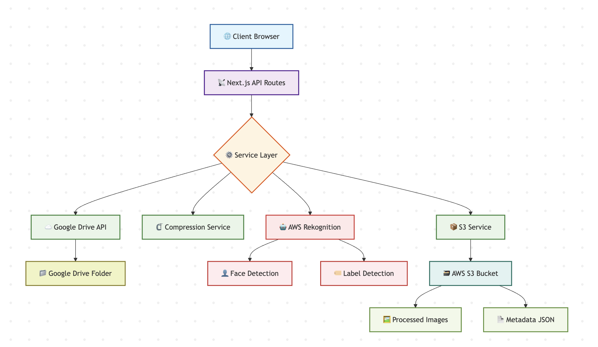

# 🖼️ Image Analyzer: AI-Powered Image Analysis from Google Drive

## Automate Image Analysis and Face Detection with Google Drive, AWS Rekognition, and S3

This project is a full-stack web application that integrates Google Drive, AWS Rekognition, and AWS S3 to provide automated image analysis, face detection, and intelligent image management capabilities. It's designed to streamline the processing of large image collections, making it easier to organize, search, and analyze visual content.

[Documentation](./SETUP_GUIDE.md) · [Quick Start](./QUICKSTART.md)

---

## Table of Contents

1. [Project Overview](#project-overview)
2. [Key Features](#key-features)
3. [Quick Start](#quick-start)
4. [Architecture](#architecture)
5. [Technology Stack](#technology-stack)
6. [Configuration](#configuration)
7. [Contributing](#contributing)
8. [Author](#author)

---

## 📋 Overview

Image Analyzer is a full-stack web application that automatically processes images from Google Drive, performs AI-powered analysis using AWS Rekognition, and provides an intelligent gallery with face detection and content-based search capabilities.

### 1.1 Problem Statement

Organizations and individuals face several challenges when managing large image collections:

- Manual processing of large volumes of images from cloud storage is time-consuming.
- Lack of automated image analysis and metadata extraction.
- Difficulty in organizing and searching images based on visual content.
- No automated face recognition across multiple images.
- High storage costs for unoptimized images.

### 1.2 Proposed Solution

The Image Analyzer is a comprehensive web-based solution that addresses these challenges through:

1. **Automated Cloud Integration**: Direct integration with Google Drive for seamless image access.
2. **AI-Powered Analysis**: AWS Rekognition for intelligent label detection and face recognition.
3. **Smart Storage**: Automated image compression and cloud storage using AWS S3.
4. **Interactive Interface**: User-friendly web interface for viewing and searching processed images.

---

## ✨ Key Features

- 🔄 **Automated Google Drive Integration** - Fetch images recursively from public folders
- 🗜️ **Smart Image Compression** - Automatically compress large files (40MB+ → ~10MB) with minimal quality loss
- 🤖 **AI-Powered Analysis** - AWS Rekognition for object detection, scene recognition, and face analysis
- 👤 **Advanced Face Detection** - Detect faces with attributes (age, gender, emotions) and visual overlays
- 🔍 **Intelligent Search** - Filter images by labels, search by content, face presence filtering
- ☁️ **Cloud Storage** - Secure AWS S3 storage with signed URLs
- 📱 **Responsive Design** - Works seamlessly on desktop, tablet, and mobile devices
- ⚡ **Performance Optimized** - Parallel API processing, image lazy loading, debounced search

---

## 🚀 Quick Start

### Prerequisites

- Node.js 18.0 or higher
- npm 9.0 or higher
- AWS Account (free tier eligible)
- Google Cloud Account (for Drive API)

### Installation

Visit [http://localhost:3000](http://localhost:3000) to see the app.

> **📖 Need detailed setup instructions?** Check out the [Complete Setup Guide](./SETUP_GUIDE.md)

---

## 🏗️ Architecture

  

### Architecture Components

1. **🌐 Client**: Next.js/React frontend with responsive UI
2. **📡 API Routes**: Serverless functions handling image processing pipeline
3. **⚙️ Service Layer**: Orchestrates Google Drive, compression, AI analysis, and storage
4. **☁️ External Services**: Google Drive API, AWS Rekognition, and AWS S3

---

## 🛠️ Technology Stack

- **Frontend**: Next.js 16, React 19, TypeScript, Tailwind CSS, shadcn/ui
- **Backend**: Next.js API Routes (Serverless), Sharp (Image Processing), Zod (Validation)
- **Cloud Services**: AWS S3, AWS Rekognition, Google Drive API
- **Utilities**: uuid, clsx, tailwind-merge

See the [Technical Specifications](./SETUP_GUIDE.md#2-technical-specifications) section of the setup guide for a complete list of dependencies.

---

## ⚙️ Configuration

### Environment Variables

Create a `.env.local` file in the root directory:

### AWS Setup Required

1.  **S3 Bucket**: Create a bucket in the specified region and configure CORS.
2.  **Rekognition**: Service available in the specified region. Face collection auto-created on first use.
3.  **IAM User**: Permissions: `AmazonS3FullAccess`, `AmazonRekognitionFullAccess`.

### Google Drive Setup

1.  Enable Google Drive API in Google Cloud Console.
2.  Create API Key with HTTP referrer restrictions.
3.  Folder must be set to "Anyone with the link"

> **📖 Detailed Configuration**: See [Setup Guide](./SETUP_GUIDE.md) for step-by-step instructions

---

## 🤝 Contributing

Contributions are welcome! Please feel free to submit a Pull Request.

1.  Fork the repository
2.  Create your feature branch (`git checkout -b feature/AmazingFeature`)
3.  Commit your changes (`git commit -m 'Add some AmazingFeature'`)
4.  Push to the branch (`git push origin feature/AmazingFeature`)
5.  Open a Pull Request

---

## 📄 License

This project is developed as an internship assignment.

---

## 👤 Author

**Harsha**

-   GitHub: [@igharsha7](https://github.com/igharsha7)
-   Project Link: [https://github.com/igharsha7/Image-analyser-using-AWS-Rekognition](https://github.com/igharsha7/Image-analyser-using-AWS-Rekognition)